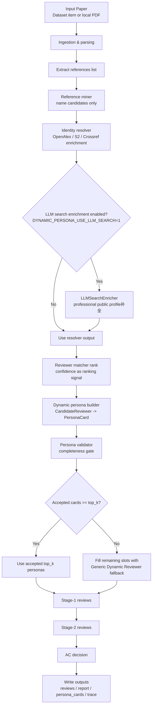

# Dynamic Persona Agent Reviewer

A multi-agent paper review framework that supports:
- **Multi-provider LLM backends** (Gemini / OpenAI)
- **Local PDF ingestion** and parsing
- **Persona-conditioned reviewing**
- **Dynamic persona generation** from paper references

This repository is now focused on an **Elo-free core review pipeline** and dynamic reviewer simulation.

---

## 1. What this project does

Given a paper (URL-based dataset or local PDF), the system can:
1. Build reviewer agents (fixed personas or dynamically generated personas)
2. Run stage-1 and stage-2 reviews
3. Let an Area Chair (AC) produce final Accept/Reject + review-quality assessment
4. Save structured outputs (`simulation_results.json` or `outputs/<paper_id>/...`)

### Persona modes
- `fixed`: built-in persona prompts under `prompt/persona/*.txt`
- `dynamic`: persona candidates mined from references + enriched via retrieval clients

---

## 2. Project structure

```text
.
├── main.py                          # CLI entrypoint
├── llm/                             # Provider abstraction + Gemini/OpenAI implementations
├── pipeline/                        # Local PDF ingest/parse/review orchestration
├── persona/                         # Dynamic persona pipeline (D milestone)
├── retrieval/                       # OpenAlex/Crossref/S2 API clients
├── role/                            # Reviewer, AC, simulation manager
├── prompt/                          # Review/AC/persona prompt templates
├── tests/                           # Milestone A/B/C/D tests
├── plan.md                          # Roadmap and milestone definitions
└── survey/background.md             # Background analysis
```

---

## 3. Environment setup

## 3.1 Python version
- Recommended: **Python 3.10+**

## 3.2 Create environment

```bash
python -m venv .venv
source .venv/bin/activate
python -m pip install --upgrade pip
```

## 3.3 Install dependencies

### Minimal runtime (Gemini + core pipeline)
```bash
pip install google-genai
```

### Add OpenAI support
```bash
pip install openai
```

### Add local PDF parsing support (Milestone C)
At least one parser is required; project uses layered fallback (`pypdf` -> `pdfplumber`):
```bash
pip install pypdf pdfplumber
```

### Optional numerical dependency
`numpy` is optional in current code path (seed fallback exists), but recommended:
```bash
pip install numpy
```

### One-shot install (recommended)
```bash
pip install google-genai openai pypdf pdfplumber numpy
```

---

## 4. API keys and runtime configuration

The CLI resolves provider/model from CLI flags first, then environment variables.

## 4.1 Environment variables

You can configure variables in **two ways**:

### Option A: export in shell (always works)
```bash
# Common
export LLM_PROVIDER=gemini           # or openai
export LLM_MODEL=gemini-2.5-flash    # or gpt-4o-mini

# Provider-specific keys
export GEMINI_API_KEY="..."
# or
export OPENAI_API_KEY="..."
```

### Option B: put them in `.env` (now supported)
Create a `.env` file in repo root:
```bash
LLM_PROVIDER=gemini
LLM_MODEL=gemini-2.5-flash
GEMINI_API_KEY=your_key_here
# OPENAI_API_KEY=your_openai_key
```

`main.py` loads `.env` automatically at startup.

### Priority and common pitfall
Priority is:
1. CLI flags (`--provider`, `--model`)
2. existing process environment variables
3. `.env` values loaded by `main.py`

So if your terminal already exported an old value, `.env` will not overwrite it.
Use one of these to avoid confusion:
```bash
unset LLM_PROVIDER LLM_MODEL GEMINI_API_KEY OPENAI_API_KEY
python main.py ...
```
or start a fresh shell.

## 4.2 CLI flags

```bash
python main.py --help
```

Current flags:
- `--provider {gemini,openai}`
- `--model MODEL`
- `--pdf PDF` (local PDF pipeline)
- `--rounds ROUNDS` (dataset simulation mode)
- `--persona-mode {fixed,dynamic}`
- `--top-k-reviewers N` (dynamic mode)

> `dynamic` persona mode works in both local PDF mode and dataset mode.
> In dataset mode, best results come from `papers.json` entries that include `content` and `references`.

### What exactly is `--rounds` and why multiple rounds?
`--rounds` controls how many review cycles the simulator runs in dataset mode (when `--pdf` is not used).

In each round:
1. the system samples papers,
2. assigns reviewer triplets,
3. runs Stage-1 and Stage-2 reviews,
4. AC makes decisions and review-quality evaluations.

Why multiple rounds:
- reduce randomness from one-off reviewer assignment,
- produce more stable aggregate behavior statistics,
- compare prompt/persona behavior across repeated interactions.

If you only want a quick smoke run, use `--rounds 1`.

---

## 5. Running guide (step-by-step)

## 5.1 Mode A: Dataset simulation (fixed personas)

Uses `papers.json` entries and runs multi-round simulation:

```bash
python main.py --provider gemini --model gemini-2.5-flash --rounds 5
```

Output:
- `simulation_results.json`

### Dataset mode with dynamic personas
```bash
python main.py --provider openai --model gpt-4o-mini --rounds 1 --persona-mode dynamic --top-k-reviewers 3
```

Note: for meaningful dynamic personas in dataset mode, each paper in `papers.json` should provide `content` and `references` fields.

## 5.2 Mode B: Local PDF review (fixed personas)

```bash
python main.py \
  --provider gemini \
  --model gemini-2.5-flash \
  --pdf /path/to/paper.pdf \
  --persona-mode fixed
```

Outputs:
- `outputs/<paper_id>/reviews.json`
- `outputs/<paper_id>/report.md`

## 5.3 Mode C: Local PDF review (dynamic personas)

```bash
python main.py \
  --provider openai \
  --model gpt-4o-mini \
  --pdf /path/to/paper.pdf \
  --persona-mode dynamic \
  --top-k-reviewers 3
```

Dynamic-mode extra output:
- `outputs/<paper_id>/persona_cards.json`

---

## 6. Input requirements

## 6.1 `papers.json` requirements (dataset simulation)
Each paper object should include:

```json
{
  "id": "paper_id",
  "url": "https://... or template with {paper_ID}",
  "actual_rating": 6.5,
  "content": "optional full paper text",
  "references": ["optional reference line 1", "optional reference line 2"]
}
```

Notes:
- `actual_rating` is optional for pure runtime, but recommended for analysis.
- If URL contains `{paper_ID}`, runtime substitutes with `id`.
- `content` + `references` are strongly recommended when using `--persona-mode dynamic` in dataset mode.

## 6.2 Local PDF requirements (ingest)
- File must exist and be readable.
- Must be non-empty.
- Size limit: <= 30MB.
- Should be a valid PDF (extension/MIME sanity checks).

## 6.3 Reference extraction assumptions
Dynamic persona mode relies on parsed reference text from PDF content.
- Better PDF text quality => better candidate mining and persona quality.
- If references are poorly extracted, system falls back to safer generic persona behavior.

---

## 7. Dynamic Persona end-to-end workflow (current implementation)

This section documents the **actual runtime workflow** implemented in code today, including inputs, processing stages, selection gates, and output artifacts.

### 7.1 Design constraints
- Candidate reviewers are extracted **only from references** (works for anonymous/unpublished submissions).
- The system does **not** use the submitted paper's author list to create reviewer candidates.
- `confidence` is used for **ranking**, not hard-threshold filtering.
- Persona usage is gated by **persona completeness validation**.

### 7.2 End-to-end flowchart



### 7.3 Inputs and entrypoints

#### Dataset mode (`main.py` without `--pdf`)
Required for dynamic quality:
- `paper['content']`: paper text (or substantial summary)
- `paper['references']`: list of reference strings

Runtime path:
- `SimulationManager._build_dynamic_reviewers()`
- `DynamicPersonaPipeline.run_with_trace()`

#### Local PDF mode (`main.py --pdf ... --persona-mode dynamic`)
Runtime path:
- `ingest_local_pdf()` parses full text + references
- `_run_dynamic_persona_review()` invokes `DynamicPersonaPipeline.run_with_trace()`

### 7.4 Processing stages (module-by-module)

1. **Reference candidate mining**
   - Module: `persona/reference_miner.py`
   - Input: `references: List[str]`
   - Output: `List[CandidateReviewer]` (name + evidence references)
   - Notes: strips numbering, handles separators (`and`, `&`, `;`), removes `et al.`, deduplicates by normalized name.

2. **Identity resolution / metadata enrichment**
   - Module: `persona/identity_resolver.py`
   - Uses retrieval clients (`OpenAlex`, `SemanticScholar`, `Crossref`) to populate affiliation, areas, source signals, publication hints, and a confidence signal.

3. **Optional LLM search-style enrichment**
   - Module: `persona/llm_search_enricher.py`
   - Enabled by: `DYNAMIC_PERSONA_USE_LLM_SEARCH=1`
   - Behavior:
     - keeps candidate identity anchored to reference-derived names,
     - asks provider for structured professional profile JSON,
     - merges affiliation/areas/evidence/style/method/concern hints.
   - If model endpoint has no search tools, this stage degrades to best-effort.

4. **Ranking (no confidence hard filter)**
   - Module: `persona/reviewer_matcher.py`
   - `rank()` scores candidates by paper/profile token overlap + confidence signal.
   - No confidence threshold rejection at this stage.

5. **Persona synthesis**
   - Module: `persona/dynamic_builder.py`
   - Converts candidate data to `PersonaCard` fields:
     - name, affiliation, research areas,
     - methodological preferences,
     - common concerns,
     - style signature,
     - potential biases,
     - confidence + evidence sources.

6. **Persona completeness validation**
   - Module: `persona/persona_validator.py`
   - Gate: `validate_persona_card(..., min_persona_completeness)`
   - Records validation trace (`accepted`, `completeness_score`, `missing_dimensions`).

7. **Top-k finalize + fallback**
   - Accepted persona cards are taken up to `top_k_reviewers`.
   - If accepted cards are insufficient, remaining slots use generic dynamic fallback reviewers.

8. **Review execution**
   - For each selected persona: stage-1 review -> stage-2 review.
   - AC aggregates into final decision.

### 7.5 Output artifacts

#### Common outputs
- `reviews.json` (review content + AC decision)
- `report.md` (human-readable summary)

#### Dynamic mode extra outputs
- `persona_cards.json`: selected persona cards (including fallbacks if used)
- `dynamic_persona_trace.json`: audit trace

Trace includes:
- reference extraction stats,
- candidate stats (`raw_count`, `resolved_count`, `selected_count`, `validated_count`, `accepted_persona_count`, `final_selected_count`),
- all candidate author records,
- selected reviewers,
- persona validation diagnostics,
- backup pool,
- fallback flag.

### 7.6 Runtime knobs (dynamic mode)
- `--top-k-reviewers N`: number of dynamic reviewers requested.
- `DYNAMIC_PERSONA_USE_LLM_SEARCH=1`: enable optional LLM enrichment stage.
- `min_persona_completeness` is currently set in pipeline constructor (default `0.75`).

### 7.7 Known behavior and trade-offs
- Reference quality strongly affects candidate recall.
- LLM search enrichment quality depends on model/tool availability.
- Keeping confidence as ranking-only improves diversity but may increase noisy candidates; persona completeness gate and fallback protect robustness.

---

## 8. Testing and validation commands

## 8.1 Targeted tests (recommended)
```bash
python -m unittest tests/test_milestone_d.py -v
python -m unittest tests/test_milestone_bc.py -v
python -m unittest tests/test_milestone_a.py -v
```

## 8.2 Full available test set
```bash
python -m unittest tests/test_milestone_a.py tests/test_milestone_bc.py tests/test_milestone_d.py -v
```

## 8.3 Syntax check
```bash
python -m py_compile main.py role/*.py llm/*.py pipeline/*.py persona/*.py retrieval/*.py \
  tests/test_milestone_a.py tests/test_milestone_bc.py tests/test_milestone_d.py
```

## 8.4 CLI health check
```bash
python main.py --help
```

---

## 9. Troubleshooting

## Missing dependency errors
- `ModuleNotFoundError: google` -> `pip install google-genai`
- `ModuleNotFoundError: openai` -> `pip install openai`
- PDF parsing failure -> install `pypdf` and/or `pdfplumber`

## API key errors
If you see provider key errors, verify:
- `GEMINI_API_KEY` for `--provider gemini`
- `OPENAI_API_KEY` for `--provider openai`

## Dynamic personas not applied (still seeing bluffer/critic/expert...)
- Confirm `--persona-mode dynamic` is passed.
- In dataset mode, ensure `papers.json` includes usable `content` and `references`; otherwise persona mining may fall back to a generic dynamic reviewer.

## Dynamic personas are empty or weak
- Check PDF extraction quality (especially references section).
- Increase `--top-k-reviewers`.
- Ensure network access to retrieval APIs if enrichment is desired.

---

## 10. Citation

If you use this project in research, please cite:

```bibtex
@misc{huang2026modelingllmagentreviewer,
      title={Modeling LLM Agent Reviewer Dynamics in Elo-Ranked Review System},
      author={Hsiang-Wei Huang and Junbin Lu and Kuang-Ming Chen and Jenq-Neng Hwang},
      year={2026},
      eprint={2601.08829},
      archivePrefix={arXiv},
      primaryClass={cs.CL},
      url={https://arxiv.org/abs/2601.08829}
}
```
